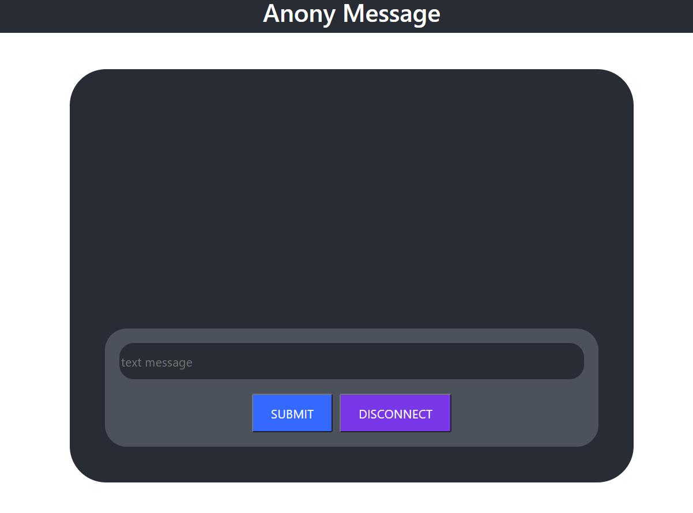

# Anonymessage
Frontend for AnonyMessage app

## Overview
- AnonyMessage app allows users to talk to each other anonymously in a chat room. This can help with loneliness and be therapeutic to the user. Also, assure the anonymity of the user.

## App Image
- 

- 

## Set Up
- dependencies: npm install
- start: npm start
- enviroment variables:
  * REACT_APP_BASE_URL= (base url to backend socket connection)
  * REACT_APP_EXTENSION= (extention url to socket connection)

## [Team Besh](https://github.com/BESH-401)
- [Keian Anthony](https://github.com/Keian-A)
- [Tek Jones](https://github.com/Tekthree)
- [Alexander Williams](https://github.com/SpaceLobster2311)
- [Louis Lassegue](https://github.com/mrloulass)

## Technologies
- [React](https://reactjs.org/docs/getting-started.html)
- [React-Bootstrap](https://react-bootstrap.github.io/getting-started/introduction)
- [CSS](https://www.w3.org/TR/CSS/#css)
- [Netlify](https://docs.netlify.com/?_ga=2.207155094.468485586.1626298259-1438724036.1626298259): deploy frontend
- [Socket.io-client](https://socket.io/docs/v4/client-api/): use on the frontend for client API
- [dotenv](https://www.npmjs.com/package/dotenv): hiding environment variables

## Links
- [AnonyMessage App](https://anony-message.netlify.app/)
- [AnonyMessage backend code](https://github.com/BESH-401/anonymessage-backend)
- [AnonyMessage frontend code](https://github.com/BESH-401/anonymessage-frontend)

## License for logo
- [License](./license_certificate_E24LFNRBUZ.txt)